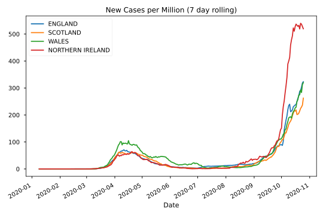
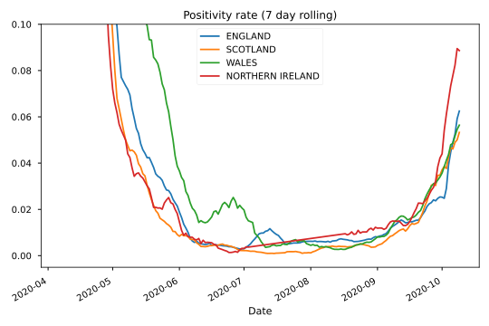
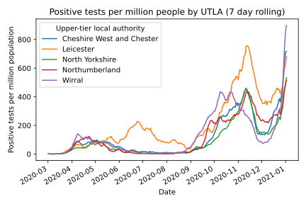

# Coronavirus in the UK

## Visualisations and elementary analysis
The goal of this project is to make simple visualisations of the case, death and testing data for different regions of the UK, using the data from the [Coronavirus (COVID-19) in the UK](https://coronavirus.data.gov.uk/developers-guide) data and API, developed by Public Health England and NHSX. 
The population data is from the mid-year population estimates, `mid-2019-april-2020-geography', which is made availiable by the ONS [here](https://www.ons.gov.uk/datasets/mid-year-pop-est/editions/mid-2019-april-2020-geography/versions/1).
These files contain public sector information from these sources licensed under the Open Government Licence v3.0.
Mapping data contains OS data © Crown copyright and database right 2019.

## Example visualisations
These visualisations each use a 7-day rolling average to draw attention to the overall trend and reduce the effect of variations during the working week and noise.
These figures last updated on 04/10/2020.

### Cases by nation throughout the pandemic

### Hospital admissions by nation throughout the pandemic

### Deaths by nation throughout the pandemic

### Positivity rate by nation throughout the pandemic

The y-axis is limited here to a maximum of 0.1, to better visualise the more recent data. This is needed due to a large spike during the first wave of cases, when test availability was more severely limited.
### Cases by the upper-tier local authority

This displays cases in a small number of local authorities. Here the cases are by specimen date, which leads to a downtick for the most recent dates, due to reporting lag. In order to combat this effect the data from the most recent days has been omitted.

## Map of confirmed cases by upper-tier local authority

Images last updated 10-10-2020.