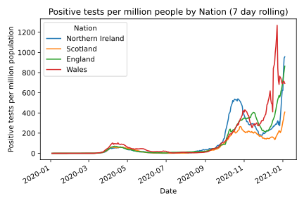
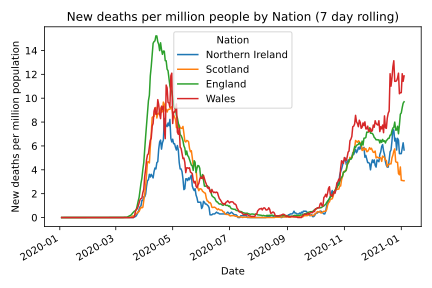
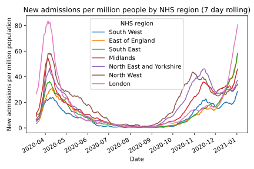

# Coronavirus in the UK

## Visualisations and elementary analysis
The goal of this project is to make simple visualisations of the case, death and testing data for different regions of the UK, using the data from the [Coronavirus (COVID-19) in the UK](https://coronavirus.data.gov.uk/developers-guide) data and API, developed by Public Health England and NHSX. 
The population data is from the mid-year population estimates, `Mid 2019: April 2019 local authority district codes', which is made available by the ONS [here](https://www.ons.gov.uk/peoplepopulationandcommunity/populationandmigration/populationestimates/datasets/populationestimatesforukenglandandwalesscotlandandnorthernireland).
These files contain public sector information from these sources licensed under the Open Government Licence v3.0.
Mapping data contains OS data © Crown copyright and database right 2019.

## Example visualisations
These visualisations each use a 7-day rolling average to draw attention to the overall trend and reduce the effect of variations during the working week and noise.
These figures last updated on 04/10/2020.

### Cases by nation throughout the pandemic

### Deaths by nation throughout the pandemic

### Hospital admissions by NHS region throughout the pandemic

### Cases by the upper-tier local authority

This displays cases in a small number of local authorities. Here the cases are by specimen date, which leads to a downtick for the most recent dates, due to reporting lag. To combat this effect, the data from the most recent days is omitted.

## Map of confirmed cases by the upper-tier local authority
This gif displays the most recent 250 days of COVID-19 data for local authorities in the UK. Note that this is a flawed metric because the capacity for testing has improved significantly over the course of the pandemic.

Areas are grey where/when data is not available.

Images last updated 09-11-2020.
